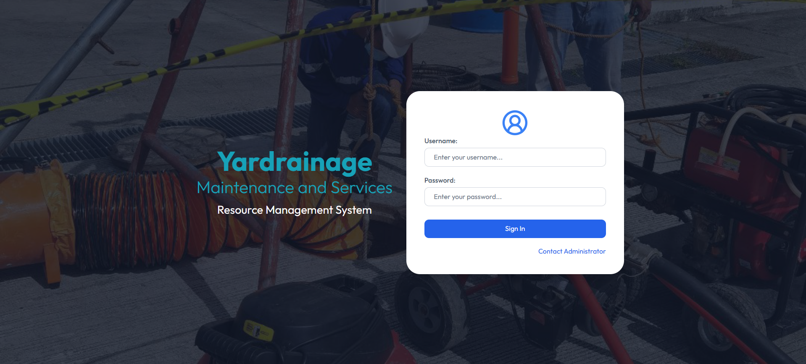
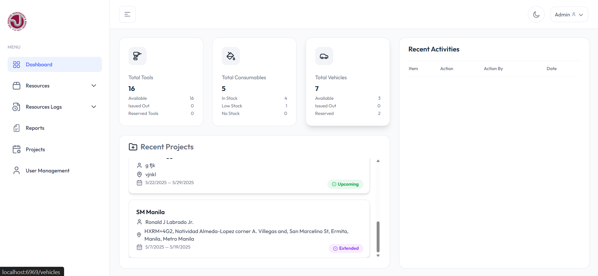
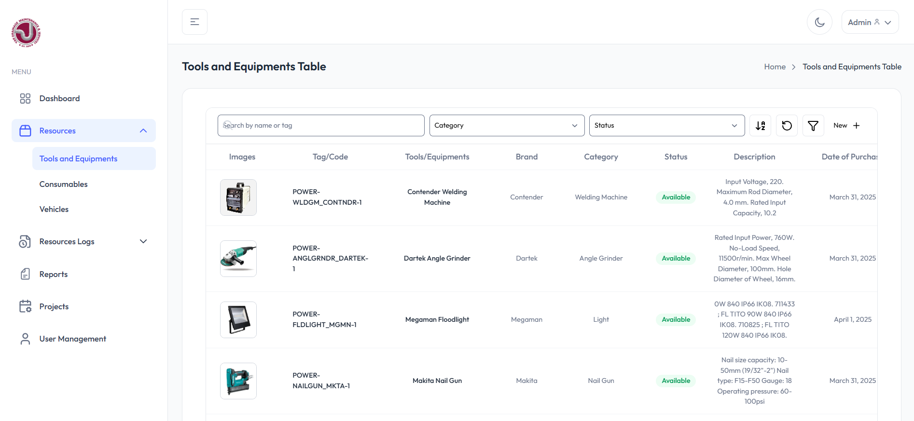
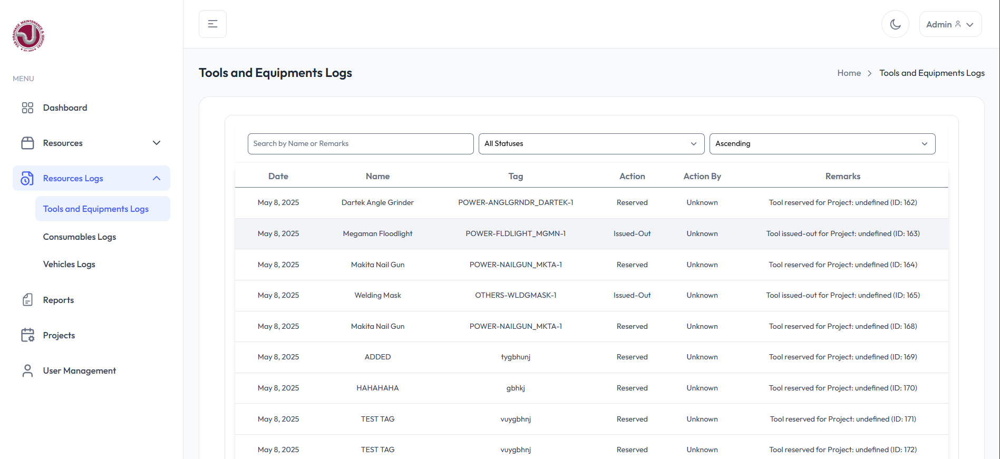
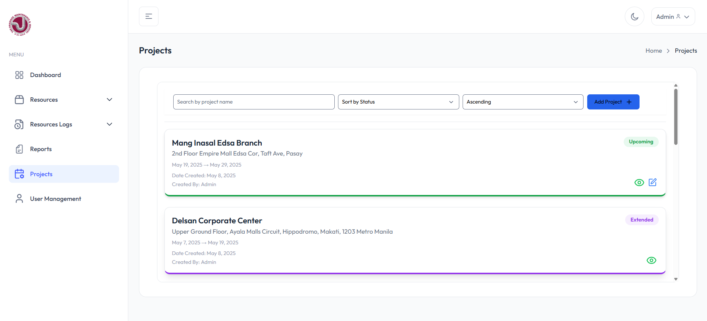
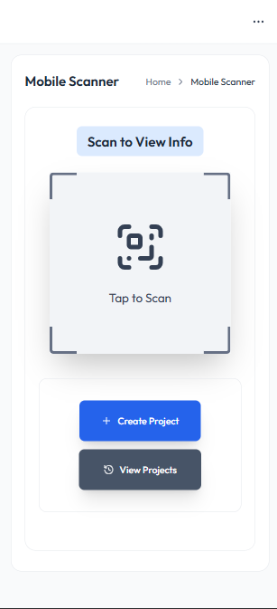

# Yar Drainage Resource Management System

A web-based resource management system designed for Yar Drainage — a company specializing in construction and drainage services. This web-based application helps manage tools, equipment, vehicles, and consumables with better tracking, and resource visibility.

 🔗 [**Live Demo**](http://yar-ims.s3-website-ap-southeast-2.amazonaws.com/)  
 🎓 Capstone Project | 👥 Client-Based 

---

## 🔧 Tech Stack

- **Frontend**: React, TypeScript, Tailwind CSS
- **Backend**: Node.js, Express.js
- **Database**: MySQL
- **Tools**: GitHub, XAMPP

---

## 📂 Features

- ✅ Role-based user access (Admin, Project Manager, Staff)
- ✅ Inventory tracking for tools, consumables, and vehicles
- ✅ QR code scanning for mobile check-in/check-out
- ✅ File/image upload for each inventory item
- ✅ History logs and remarks per item
- ✅ Project-based resource allocation
- ✅ Responsive UI for desktop and mobile use

---

## 🖼️ Screenshots

   
  <strong>Login Page</strong>
    

   
  <strong>Dashboard</strong>
    

   
  <strong>Inventory Management</strong>
    

   
  <strong>History Logs</strong>
    

   
  <strong>Projects Page</strong>
    

   
  <strong>Mobile QR Scanner</strong>

---

## 🚀 Prerequisites
- Node.js & npm
- MySQL server
- XAMPP (or any local server for database)

